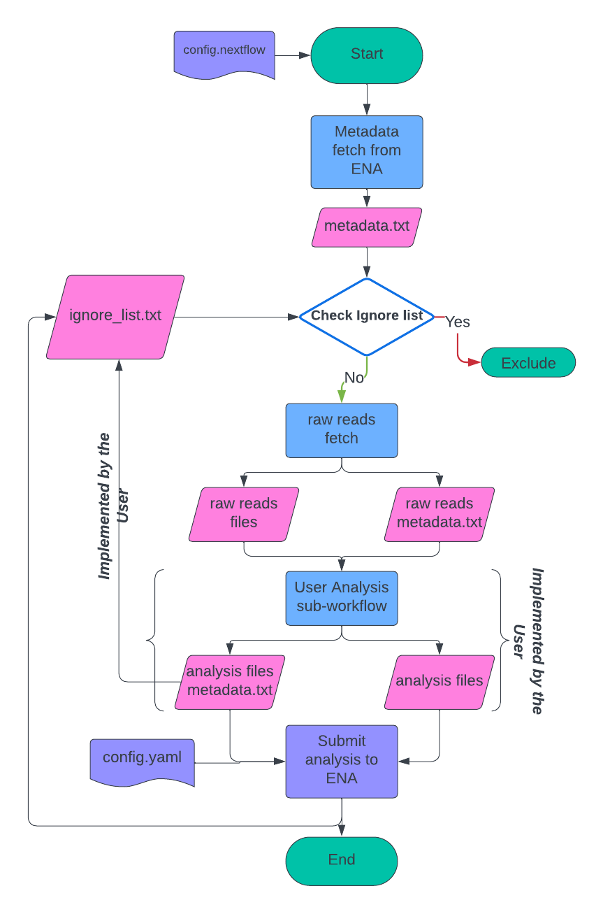

# 

**ENA Local DataHub**.

[](https://www.nextflow.io/)
[](http://bioconda.github.io/)

## Introduction

The Local DataHub pipeline is built using [Nextflow](https://www.nextflow.io), a workflow tool to run tasks across multiple compute infrastructures in a very portable manner. It comes with docker containers making installation trivial and results highly reproducible.
Local Data Hubs is a collection of standardised tools and workflows that can be used by collaborators using their own computing infrastructure following ENA standards.

- ENA is the main repository to consume raw data and submitting the analysed data. 
- Standardised workflow template that suitable for the majority of the analysis types.
- User friendly workflow that can be implemented simply on the user’s computing infrastructure
****

## User's Analysis Module/Subworkflow ##
This step is implemented by the user. The user can create as much modules as needed and combine them in a single subworkflow. The workflow must be able to consume and parse the output from the Raw read fetching module and produce the input of the Analysis submission module
**Input:**
- Comma separated text file 
-- Run Accession
--  Sample Accession
--  Raw read file name
- Raw reads files 

**Output:**
- Comma separated text file
-- Run Accession
-- Sample Accession 
-- Analysis File name including the **relative path**
- Analysis Files

**This process is done per run downloaded as follows:**
```
# You can retrive the run accession, sample accession and the file name and inject them in the next process by refrencing the following: 
         run accession: fetched_metadata.run_acc
         sample accession: fetched_metadata.sample_acc
         file name: fetched_metadata.file_name
```
```
# EXAMPLE OF THE USER SUB-WORKFLOW : 
        user_output_ch = user_process (fetched_metadata.run_acc, fetched_metadata.sample_acc, fetched_metadata.file_name, otherInputParams)
```
```
# Parse the metadata file and retrieve the runs along with their corresponding samples and analysed file names(should be including the relative path)
        analysed_metadata_content = user_output_ch .splitCsv( header: ['run_accession','sample_accession', 'file_name'], skip: 1 ).multiMap { it ->
        run_acc: it['run_accession']
        sample_acc: it['sample_accession']
        analysis_file: it['analysis_file']
        }
        .set{analysed_metadata}  
```
```

# The parameters retrieved from the user channel's output can be used as inputs in the submission channel, as follows:
        run accession: analysed_metadata.run_acc
        sample accession: analysed_metadata.sample_acc
        analysis_file: analysed_metadata.file_name
```

*Execute the analysed file submitting process. The parameters values for run_accession (analysed_metadata.run_acc), sample accession (analysed_metadata.sample_acc) and analysed file names (analysed_metadata.file_name) can be used as an input for the analysis step* 

## Prerequisites

i. Install [`nextflow`](https://nf-co.re/usage/installation)

ii. Install [`Conda`](https://conda.io/miniconda.html) and either [`Docker`](https://docs.docker.com/engine/installation/) or [`Singularity`](https://www.sylabs.io/guides/3.0/user-guide/) for full pipeline reproducibility (please only use [`Conda`](https://conda.io/miniconda.html) as a last resort; see [docs](https://nf-co.re/usage/configuration#basic-configuration-profiles))

iii. Data download required FTP, please make sure FTP is installed at your system 


## Documentation

The ENA/localdatahub pipeline comes with documentation about the pipeline, found in the `docs/` directory:

1. [Installation](https://nf-co.re/usage/installation), Note that the *Automatic* section of the *pipeline code* described in the documentation is not supported 
2. Pipeline environment configuration.
    - The *environment.yml* file contains the packages necessary to run the template, you can add the analysis module/sub-workflow packages to the file either manually or by using conda: `conda env create -f environment.yml`
    - The *Dockerfile* provided is linked to the *environment.yml* file. By using the Dockerfile to build the image, it will contain all the packages specified in the *environment.yml* file including the LocalDatahub's template and the analysis module/subworkflow packages. For  further information on Docker please check the [Docker documentation](https://docs.docker.com/reference/cli/docker/image/build/). 

<!-- TODO: Add a brief overview of what your pipeline does and how it works -->
3. [Running the pipeline](docs/usage.md)
4. [Output and how to interpret the results](docs/output.md)


## Credits

ENA/localdatahub template was originally written by ahmad zyoud.

## Citation

> **The nf-core framework for community-curated bioinformatics pipelines.**
>
> Philip Ewels, Alexander Peltzer, Sven Fillinger, Harshil Patel, Johannes Alneberg, Andreas Wilm, Maxime Ulysse Garcia, Paolo Di Tommaso & Sven Nahnsen.
>
> _Nat Biotechnol._ 2020 Feb 13. doi: [10.1038/s41587-020-0439-x](https://dx.doi.org/10.1038/s41587-020-0439-x).  
> ReadCube: [Full Access Link](https://rdcu.be/b1GjZ)
